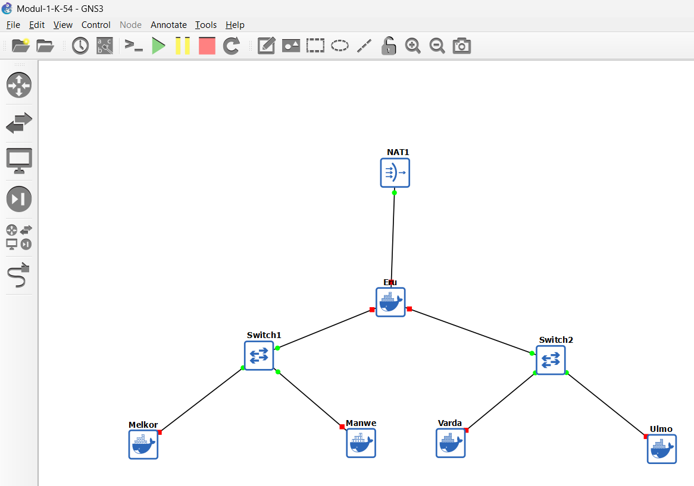
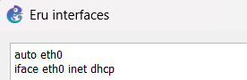
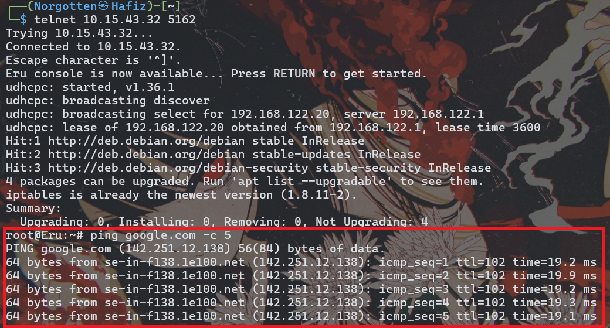
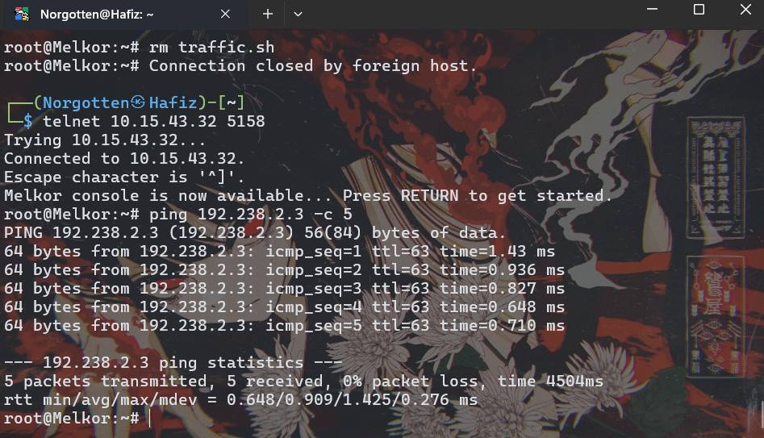
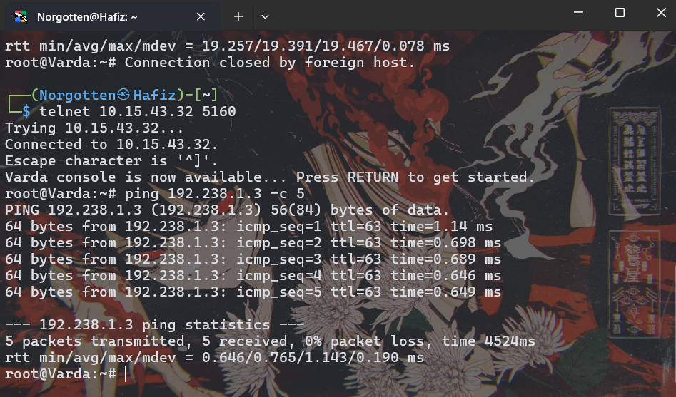
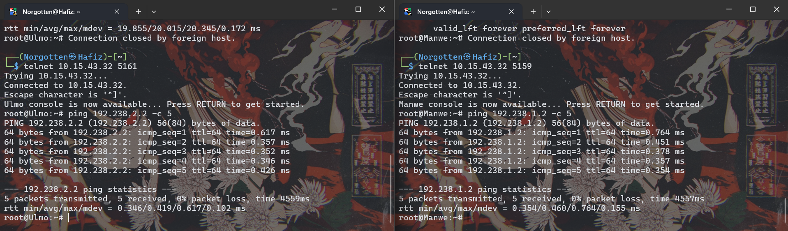
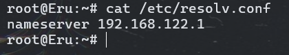
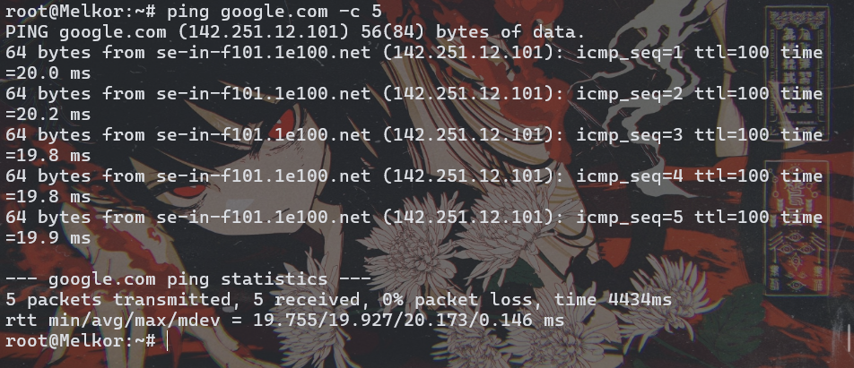

# Jarkom-Modul-1-2025-K54

| No | Nama                              | NRP         |
|----|-----------------------------------|-------------|
| 1  | Salsa Bil Ulla         | 5027241052 |
| 2  | Hafiz Ramadhan   | 5027241096  |

## Soal 1

Untuk nomor 1 kurang lebih sama seperti yang ada pada modul GNS3, yaitu menambah/memasukkan:
- Eru: router(ervn-debi)
- 2 Switch/Gateway
- 4 Ainur/Client (Melkor, Manwe, Varda, Ulmo)

## Soal 2
Agar Eru bisa mengakses internet, kita tambahkan:
```
auto eth0
iface eth0 inet dhcp
```

pada network config nya.



Bisa dilihat Eru sudah bisa melakukan ping ke google.

# Soal 3
Agar client dapat terhubung satu sama lain, kita ubah network config pada Eru terlebih dahulu:
```
auto eth0
iface eth0 inet dhcp

auto eth1
iface eth1 inet static
	address 192.238.1.1
	netmask 255.255.255.0

auto eth2
iface eth2 inet static
	address [Prefix IP].2.1
	netmask 255.255.255.0
```
Lalu untuk masing masing client, kita tambahkan juga kedalam network confignya:
- Melkor
```
auto eth0
iface eth0 inet static
	address 192.238.1.2
	netmask 255.255.255.0
	gateway 192.238.1.1
```
- Manwe
```
auto eth0
iface eth0 inet static
	address 192.238.1.3
	netmask 255.255.255.0
	gateway 192.238.1.1
```
- Varda
```
auto eth0
iface eth0 inet static
	address 192.238.2.2
	netmask 255.255.255.0
	gateway 192.238.2.1
```
- Ulmo
```
auto eth0
iface eth0 inet static
	address 192.238.2.3
	netmask 255.255.255.0
	gateway 192.238.2.1
```

Sekarang, seharusnya client sudah dapat terhubung satu sama lain, bisa kita lihat beberapa contoh dibawah ini:



Bisa dilihat Melkor sudah bisa tersambung ke Ulmo.



Varda juga sudah dapat terhubung ke Manwe.



Ulmo dan Manwe juga sudah bisa.

## Soal 4
Agar setiap client dapat tersambung ke internet, lakukan:



```
cat /etc/resolv.conf
```

untuk melihat isi file konfigurasi DNS resolver di Eru.

Lalu gunakan:
```
echo nameserver 192.168.122.1 > /etc/resolv.conf
```

pada setiap client, untuk mengarahkan semua permintaan DNS ke DNS NAT-nya GNS3

setelah itu gunakan:
```
iptables -t nat -A POSTROUTING -o eth0 -j MASQUERADE -s 192.238.0.0/16
```

Sekarang setiap client sudah dapat tersambung ke internet




## Soal 14
```
nc 10.15.43.32 3401
```
#### FLAG
```
KOMJAR25{Brut3_F0rc3_5JqXUmMFjVeW8AuDcq9rR0aaQ}
```


#### Q1: How many packets are recorded in the pcapng file? (Format: int)
```
> 500358
```
Buka Wireshark dan buka `shortbf.pcapng`, maka akan terlihat jumlah paket di kanan bawah.


#### Q2: What are the user that successfully logged in? (Format: user:pass)
```
> n1enna:y4v4nn4_k3m3nt4r1
```
Masukkan `http contains "success"` pada kolom filter.


Lalu klik kanan packet untuk `Follow HTTP Stream`.


#### Q3: In which stream were the credentials found? (Format: int)
```
> 41824
```
Pada details, scroll ke bagian `Tranmission Control Protocol` hingga menemukan `Stream index`.


#### Q4: What tools are used for brute force? (Format: Hydra v1.8.0-dev)
```
> Fuzz Faster U Fool v2.1.0-dev
```
Klik kanan pada packet, lalu `Follow HTTP Stream`, tools tertera pada `User-Agent`.


## Soal 15
```
nc 10.15.43.32 3402
```
#### FLAG
```
KOMJAR25{K3yb0ard_W4rr10r_V9IxfCMHIM9BsNAY34P4AN2L4}
```


#### Q1: What device does Melkor use? (Format: string)
```
> Keyboard
```
Pada details di salah satu packet, tertera jika usage menggunakan USB Keyboard.


#### Q2: What did Melkor write? (Format: string)
```
> UGx6X3ByMHYxZGVfeTB1cl91czNybjRtZV80bmRfcDRzc3cwcmQ=
```
Ketik `usb.transfer_type == 0x01` pada filter, lalu simpan sebagai `plain text` melalui `File`.

> [awok.txt](https://github.com/zeeyclore/Jarkom-Modul-1-2025-K54/blob/main/awok.txt)

Buat script dengan `nano [nama script].py` untuk membaca hasil file log `.txt` yang berisikan data HID berbentuk hex.

> [awokdecode.py](https://github.com/zeeyclore/Jarkom-Modul-1-2025-K54/blob/main/awokdecode.py)

Jalankan `python3 [nama script].py` dan hasil sudah muncul di output langsung.


#### Q3: What is Melkor's secret message? (Format: string)
```
> Plz_pr0v1de_y0ur_us3rn4me_4nd_p4ssw0rd
```
Dari hasil script tadi, di-decode dengan tools `CyberChef From Base64`.


## Soal 16
```
nc 10.15.43.32 3403
```
#### FLAG
```
KOMJAR25{Y0u_4r3_4_g00d_4nalyz3r_N9uTF98Yt2wXd1FKlRK3hsdkr}
```


#### Q1: What credential did the attacker use to log in? (Format: user:pass)
```
> ind@psg420.com:{6r_6e#TfT1p
```
Ketik `ftp || ftp-data` pada kolom filter, lalu informasi terkait user dan pass akan terlihat.


#### Q2: How many files are suspected of containing malware? (Format: int)
```
> 5
```
Ketik `ftp.request.command == "RETR"` pada kolom filter untuk memunculkan file-file yang kemungkinan berbahaya.


#### Q3: What is the hash of the first file (q.exe)? (Format: sha256)
```
> ca34b0926cdc3242bbfad1c4a0b42cc2750d90db9a272d92cfb6cb7034d2a3bd
```
Cari port dari tiap file `.exe` tadi dengan `tshark -r MelkorPlan1.pcap -Y "ftp-data" -T fields -e tcp.srcport -e tcp.dstport | sort -u | tail -5` agar mudah untuk ekspor nantinya.


Jalankan `tshark -r MelkorPlan1.pcap -Y "tcp.port == 51889 && tcp.len > 0" -T fields -e tcp.payload | xxd -r -p > q_exe_final.bin` di terminal, lalu jalankan `sha256sum q_exe_final.bin` untuk mendapatkan hasil hash `q.exe`.


#### Q4: What is the hash of the second file (w.exe)? (Format: sha256)
```
> 08eb941447078ef2c6ad8d91bb2f52256c09657ecd3d5344023edccf7291e9fc
```
Jalankan `tshark -r MelkorPlan1.pcap -Y "tcp.port == 59785 && tcp.len > 0" -T fields -e tcp.payload | xxd -r -p > w_exe_final.bin` di terminal, lalu jalankan `sha256sum w_exe_final.bin` untuk mendapatkan hasil hash `w.exe`.


#### Q5: What is the hash of the third file (e.exe)? (Format: sha256)
```
> 32e1b3732cd779af1bf7730d0ec8a7a87a084319f6a0870dc7362a15ddbd3199
```
Jalankan `tshark -r MelkorPlan1.pcap -Y "tcp.port == 59785 && tcp.len > 0" -T fields -e tcp.payload | xxd -r -p > e_exe_final.bin` di terminal, lalu jalankan `sha256sum e_exe_final.bin` untuk mendapatkan hasil hash `e.exe`.


#### Q6: What is the hash of the fourth file (r.exe)? (Format: sha256)
```
> 4ebd58007ee933a0a8348aee2922904a7110b7fb6a316b1c7fb2c6677e613884
```
Jalankan `tshark -r MelkorPlan1.pcap -Y "tcp.port == 59785 && tcp.len > 0" -T fields -e tcp.payload | xxd -r -p > r_exe_final.bin` di terminal, lalu jalankan `sha256sum r_exe_final.bin` untuk mendapatkan hasil hash `r.exe`.


#### Q7: What is the hash of the fifth file (t.exe)? (Format: sha256)
```
> 10ce4b79180a2ddd924fdc95951d968191af2ee3b7dfc96dd6a5714dbeae613a
```
Jalankan `tshark -r MelkorPlan1.pcap -Y "tcp.port == 59785 && tcp.len > 0" -T fields -e tcp.payload | xxd -r -p > t_exe_final.bin` di terminal, lalu jalankan `sha256sum t_exe_final.bin` untuk mendapatkan hasil hash `t.exe`.


## Soal 17
```
nc 10.15.43.32 3404
```
#### FLAG
```
KOMJAR25{M4ster_4n4lyzer_IUP0UnMxzseaMoArxrNlbTRTZ}
```


#### Q1: What is the name of the first suspicious file? (Format: file.exe)
```
> Invoice&MSO-Request.doc
```
Jalankan `tshark -r MelkorPlan2.pcap --export-objects http,all_files ls -la all_files/` lalu file yang terdownload akan otomatis terlihat dan yang pertama adalah `Invoice&MSO-Request.doc`.


#### Q2: What is the name of the second suspicious file? (Format: file.exe)
```
> knr.exe
```
Hasil dapat terlihat dari command di `Q1`.


#### Q3: What is the hash of the second suspicious file (knr.exe)? (Format: sha256)
```
> 749e161661290e8a2d190b1a66469744127bc25bf46e5d0c6f2e835f4b92db18
```
Jalankan `sha256sum knr.exe`.


## Soal 18
```
nc 10.15.43.32 3405
```
#### FLAG
```
KOMJAR25{Y0u_4re_g0dl1ke_4qZjUyll3QSeU81aIRWVst5DP}
```


#### Q1: How many files are suspected of containing malware? (Format: int)
```
> 2
```
Jalankan `ls -la http_files/ smb_files/` maka akan terlihat ada 2 file `.exe` dengan awalan `WINDOWS` dan nama file mencurigakan.


#### Q2: What is the name of the first malicious file? (Format: file.exe)
```
> d0p2nc6ka3f_fixhohlycj4ovqfcy_smchzo_ub83urjpphrwahjwhv_o5c0fvf6.exe
```
Dari hasil command di `Q1` sudah menunjukkan nama file aneh.


#### Q3: Apa nama file berbahaya yang kedua? (Format: file.exe)
```
> oiku9bu68cxqenfmcsos2aek6t07_guuisgxhllixv8dx2eemqddnhyh46l8n_di.exe
```
Dari hasil command di `Q1` sudah menunjukkan nama file aneh.


#### Q4: What is the hash of the first malicious file? (Format: sha256)
```
> 59896ae5f3edcb999243c7bfdc0b17eb7fe28f3a66259d797386ea470c010040
```
Jalankan `sha256sum "smb_files/%5cWINDOWS%Scd0p2nc6ka3f_fixhohlycj4ovqfcy_smchzo_ub83urjpphrwahjwhv_o5c0fvf6.exe"` di terminal, hash akan langsung ter-print.


#### Q5: What is the hash of the second malicious file? (Format: sha256)
```
> cf99990bee6c378cbf56239b3cc88276eec348d82740f84e9d5c343751f82560
```
Jalankan `sha256sum "smb_files/%5cWINDOWS%Scoiku9bu68cxqenfmcsos2aek6t07_guuisgxhllixv8dx2eemqddnhyh46l8n_di.exe"` di terminal, hash akan langsung ter-print.


## Soal 19
```
nc 10.15.43.32 3406
```
#### FLAG
```
KOMJAR25{Y0u_4re_J4rk0m_G0d_kBdVLljgIyR9nnyqSFd3cjC87}
```


#### Q1: Who sent the threatening message? (Format: string (name))
```
> Your Life
```
Jalankan `smtp.req.command == "MAIL"` agar menampilkan seluruh pesan dari log. Pesan paling banyak berasal dari akun `YourLife[...]@[...].com`.


Jika melakukan `Follow TCP Stream` akan terlihat isi dari log tersebut dan nama utama dari email tersebut adalah `Your Life`.


#### Q2: How much ransom did the attacker demand ($)? (Format: int)
```
> 1600
```
Masih dengan cara yang sama dari `Q1`, jumlah uang yang diinginkan oleh attacker disebutkan di dalam pesan.


#### Q3: What is the attacker's bitcoin wallet? (Format: string)
```
> 1CWHmuF8dHt7HBGx5RKKLgg9QA2GmE3UyL
```
Masih dengan cara yang sama dari `Q1`, dompet bitcoin attacker disebutkan di dalam pesan.


## Soal 20
```
nc 10.15.43.32 3407
```
#### FLAG
```
KOMJAR25{B3ware_0f_M4lw4re_AGCe0yhAX9U82C38E4Ow72nEP}
```


#### Q1: What encryption method is used? (Format: string)
```
> TLS
```
Dalam folder zip terdapat 2 file yaitu `MelkorPlan5.pcap` dan `keyslogfile.txt`. Saat dibuka, `keyslogfile.txt` menunjukkan teks `CLIENT RANDOM` yang biasa digunakan untuk decrypt TLS traffic di Wireshark.


#### Q2: What is the name of the malicious file placed by the attacker? (Format: file.exe)
```
> invest_20.dll
```
Setelah membuka `MelkorPlan5.pcap` pada Wireshark, lakukan `CTRL + SHIFT + P` atau dapat pergi ke `Edit` pada pojok kiri atas lalu ke `Preferences..`. Lalu ke `Protocols` dan cari `TLS`. Pada `(Pre)-Master-Secret log filename`, lakukan `Browse...` dan cari file `keyslogfile.txt` di komputer. Setelah itu bisa langsung `Apply` dan klik `OK`.


Nanti packet number `165` akan berubah yang tadinya `TLSv1.2` menjadi `HTTP`. Info terbuka menunjukkan `GET /invest_20.dll HTTP/1.1` yang di mana adalah file malicous.


#### Q3: What is the hash of the file containing the malware? (Format: sha256)
```
>  31cf42b2a7c5c558f44cfc67684cc344c17d4946d3a1e0b2cecb8eb58173cb2f
```
Jalankan `tshark -r MelkorPlan5.pcap -o tls.keylog_file:keyslogfile.txt -Y "ip.addr==94.103.84.245 and tcp.port==50074" --export-objects http,export_folder` di terminal.


Lalu jalankan `sha256sum invest_20.dll

